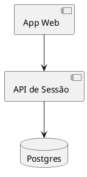
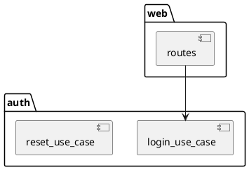
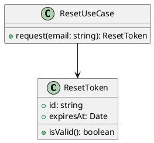
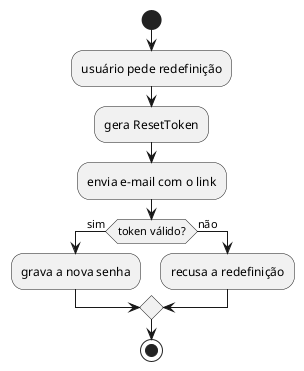

Seu objetivo é congelar a spec da solução e deixá-la herdável pelas Issues seguintes.

Os requisitos desta Issue chegam no prompt sob `## Features desta Issue`: são as Features Gherkin do grupo que ela cobre — **uma ou várias**, agrupadas por conceito de domínio no Planning.
A spec tem que cobrir **todas** elas; nenhuma outra Issue vai desenhá-las.

## Heurísticas

- **Explorar desenho** (opcional): só se os requisitos não bastarem para especificar; apresente opções + trade-offs e peça a direção ao humano antes de congelar.
- **Prototipar** (opcional): artefato **descartável** em worktree; não vira produto.
- Quanto maior o risco/complexidade, mais alinhamento antes de congelar a spec.
- **Como** desenhar e especificar é decisão do agente.

## Entrega 1 — a decisão de arquitetura

```bash
issues design changed --issue <id> --value false
```

Obrigatória: sem ela a conclusão falha com `decision_required`.
Ela escolhe o caminho:

- `false` — atalho: dispensa `design.md` e diagramas; basta o plano. A IA pode fechar (AFK).
- `true` — exige `design.md` + os **4 níveis** de diagramas PlantUML e o aceite é **humano**: nunca fecha AFK, só `AWAITING`.

## Entrega 2 — o plano de implementação

```bash
issues plan set --id <id> --file ./plan.json
```

Os quatro campos são obrigatórios; `passos` e `arquivos` são arrays com ao menos um texto não vazio:

```json
{
  "objetivo": "Autenticar o usuário por e-mail e senha, devolvendo um token de sessão.",
  "passos": [
    "Criar o caso de uso de autenticação com verificação de hash da senha.",
    "Expor o endpoint POST /login que devolve o token.",
    "Cobrir credencial válida e inválida com testes."
  ],
  "arquivos": [
    "src/auth/login_use_case.ts",
    "src/web/routes/login.ts",
    "test/auth/login.test.ts"
  ],
  "criterio_pronto": "POST /login devolve 200 com token para credencial válida e 401 para inválida, com testes verdes."
}
```

## Entrega 3 — uma Issue Implement por fatia

O gate exige **ao menos uma filha `action=Implement`** antes de fechar.
Cada filha traz o seu **Small Plan** no campo `plan` (mesmo formato do `plan.json`, obrigatório): ele é persistido como o plano da filha e prevalece no prompt dela.

```bash
issues decompose --id <id> --into ./decompose.json --agent <ia>
```

```json
{
  "mode": "sequential",
  "children": [
    {
      "title": "Implement: caso de uso de autenticação",
      "type": "Feat",
      "action": "Implement",
      "problem": "Implementar a verificação de e-mail e senha e a emissão do token.",
      "acceptance_criteria": "Credencial válida devolve token; inválida devolve erro.",
      "plan": {
        "objetivo": "Autenticar e-mail e senha e emitir o token de sessão.",
        "passos": [
          "Escrever os testes de credencial válida e inválida.",
          "Implementar o caso de uso até os testes passarem."
        ],
        "arquivos": ["src/auth/login_use_case.ts", "test/auth/login.test.ts"],
        "criterio_pronto": "Testes do caso de uso verdes e check do projeto passando."
      }
    }
  ]
}
```

Fatie em Implements pequenos: cada um deve entregar uma fatia funcional/integrável.
`mode`: `sequential` encadeia as filhas para execução em ordem; `concurrent` (default) deixa-as independentes.
`decompose` já grava a linhagem parent/child recíproca — não chame `relate` depois.

## Entrega 4 — o Artefato da spec

```bash
issues artifact --id <id> --file ./artifact.md
```

O **nome do arquivo é irrelevante**; use `./artifact.md`.
É este texto que viaja no prompt das Issues filhas. Máximo 300 palavras.

```markdown
# Spec congelada

- Decisão de arquitetura: <muda / não muda> — <por quê>
- Solução: <o desenho em 2 ou 3 linhas>

## Fatias

1. <fatia que virou Issue Implement>
2. <fatia que virou Issue Implement>

## Riscos

- <risco conhecido, ou "Nenhum">
```

## Só quando `architecture_changed=true`

```bash
issues design doc --issue <id> --file ./design.md
issues design add --issue <id> --kind component --file ./component.puml
issues design add --issue <id> --kind package   --file ./package.puml
issues design add --issue <id> --kind class     --file ./class.puml
issues design add --issue <id> --kind activity  --file ./activity.puml
```

`design.md` é um Markdown livre (não vazio, ≤300 palavras) com a decisão, as alternativas descartadas e os contratos.

Os 4 níveis precisam estar cobertos por PlantUML válido.
Mapeamento kind→nível: `component`/`deployment` → **High Level**; `package` → **Package**; `class` → **Class**; `activity`/`state` → **Interface/DataModel**.
A sintaxe é validada fail-fast e o kind precisa bater com o diagrama detectado; regravar o mesmo kind substitui.
Um diagrama mínimo válido de cada nível:









## Consulta

- `issues get DESIGN --id <id>` — o pacote com `architecture_changed`, `validation.ready` e os erros do gate.
- `issues get PLAN --id <id>` — o plano persistido.

## Encerramento

```bash
issues status --id <id> --agent <ia> --status CLOSED \
  --comment "<evidência: decisão de arquitetura, desenho, fatias criadas>" --reason concluido
```

Com `architecture_changed=true`, HITL, `risk=ALTO` ou `complexity=ALTA`: use `--status AWAITING` (sem `--reason`) — o fechamento é do humano, via `decide` no web.
**Gate**: sem a decisão de arquitetura, sem plano válido e sem ao menos uma filha Implement, o comando sai com exit 1 e JSON `{"errors":[…]}` no stderr; a Issue permanece no status atual.
Concluída a Issue, **encerre a sessão**: não busque outra Issue.
